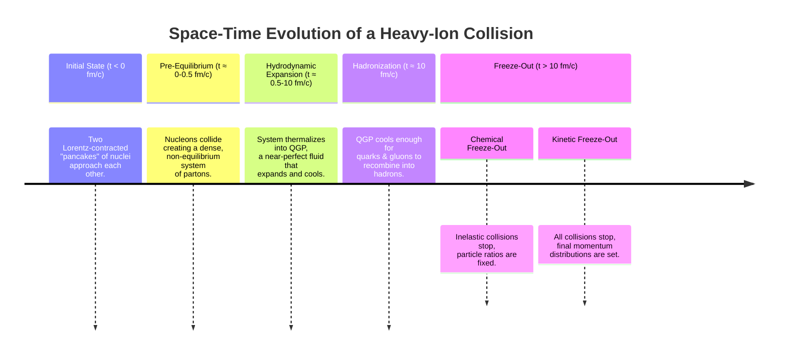

### **1. What is the Quark-Gluon Plasma (QGP)?**

**Core Definition:** The QGP is a state of **deconfined, strongly interacting matter in (local) thermal equilibrium**.

*   **Deconfined:** At ordinary temperatures, quarks and gluons are permanently confined inside protons, neutrons, and other hadrons. In the QGP, this confinement is overcome. Quarks and gluons are no longer bound into individual hadrons but can roam freely over a volume much larger than a single proton.
*   **Strongly Interacting:** Despite being deconfined, the quarks and gluons interact very strongly with each other. This is not a dilute, ideal gas but a dense, interacting liquid.
*   **Thermal Equilibrium:** The system has a defined temperature, meaning the energy is distributed among its constituents according to the rules of thermodynamics and statistical mechanics.

**Analogy:** Think of an ice cube (a hadron) melting into liquid water (the QGP). The H₂O molecules are the same, but their bonds and collective properties change dramatically. The QGP is like a "meltdown" of nuclear matter.

---

### **2. Why Do We Study QGP? (The Motivation)**

Studying the QGP is a fundamental test of Quantum Chromodynamics (QCD) under extreme conditions. It addresses profound questions:

1.  **Confinement and Mass Generation:** How does QCD, which has nearly massless quarks and gluons, generate the mass of protons and neutrons (which make up most of our mass)? The QGP allows us to study the transition between the confined world (where mass is generated dynamically) and the deconfined world.
2.  **The Strongest Force in Nature:** At extremely high temperatures, QCD predicts that the strong force becomes weak due to **asymptotic freedom**. The QGP lets us test this prediction and explore the transition from a weakly coupled plasma at very high temperatures to the **strongly coupled liquid** we actually observe at accessible energies.
3.  **A Perfect Liquid:** Data shows the QGP has an extremely low **viscosity-to-entropy ratio**, making it the most "perfect" or least viscous liquid known in nature—even more so than ultra-cold atoms. This points to a strongly coupled system.
4.  **Cosmology and Astrophysics:** The entire universe was in a QGP state a few microseconds after the Big Bang. The cores of neutron stars might also contain QGP or other exotic forms of quark matter. This research connects nuclear physics to the origin and evolution of the universe.

---

### **3. The Thermodynamics Toolkit**

To describe the QGP, we use statistical mechanics. The key concept is the **partition function ($Z$)**, which is a sum over all possible states of the system. From $Z$, we can derive all thermodynamic properties:

*   **Pressure ($P$)**
*   **Energy Density ($ϵ$)**
*   **Entropy ($S$)**
*   **Particle Densities ($n$)**

**Key Results for Ideal Gases (Simplified Model):**

*   **Non-Relativistic Gas (Heavy Hadrons):** Particle density $n \propto e^{-m/T}$. This explains why heavy particles (like omega baryons) are very rare in the QGP; they are "Boltzmann-suppressed."
*   **Ultra-Relativistic Gas (Light Quarks/Gluons):**
    *   Energy Density: $ϵ \propto T^4$ (Stefan-Boltzmann Law)
    *   Pressure: $P = \frac{1}{3}ϵ$
    *   Particle Density: $n \propto T^3$

These relations are crucial for interpreting data. The fact that the real QGP deviates from these ideal gas laws is a signature of its strong interactions.

---

### **4. The "Standard Model" of a Heavy-Ion Collision**

When two heavy nuclei (like Lead or Gold) collide at nearly the speed of light, they create a QGP that evolves through a specific sequence of stages. The following timeline visualizes this process:

**Key Concepts in the Evolution:**

*   **Local Thermal Equilibrium:** The system is not uniform, but we can describe small, local "fluid cells" with their own temperature and density.
*   **Boost Invariance:** At high energies, the central region of the collision looks the same regardless of the observer's longitudinal frame. This simplifies the modeling.
*   **Freeze-Out:** The process where the expanding matter becomes so dilute that particles stop interacting.
    *   **Chemical Freeze-Out:** The composition (ratios of protons, pions, kaons, etc.) gets fixed.
    *   **Kinetic Freeze-Out:** The particles' momenta get fixed as they stop elastically scattering.

---

### **5. Key Observables and What They Tell Us**

The text introduces several tools and observables used to probe the different stages:

*   **Jets:** Sprays of particles from a high-energy quark or gluon. When jets pass through the QGP, they lose energy ("jet quenching"), providing a direct probe of the dense medium's properties.
*   **Flow Patterns:** The collective, correlated motion of particles. The fact that this flow is observed and is well-described by hydrodynamics is the strongest evidence that the QGP behaves like a near-perfect fluid.
*   **Particle Abundances:** The ratios of different hadron species (e.g., protons, kaons, pions) are used to determine the **chemical freeze-out temperature** and the conditions of the system when hadrons formed.

### **Summary**

The study of QGP is the study of nuclear matter under extreme conditions. By smashing heavy ions together at relativistic speeds, we recreate a piece of the early universe in the laboratory. The observed evolution from a dense, initial state through a perfectly flowing liquid QGP to a gas of hadrons provides a unique testing ground for QCD and our understanding of the fundamental forces of nature.