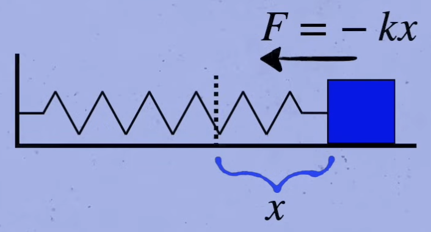

## Spring harmonic oscillator
Let's start with an example on a spring:

where the spring force is represented by 
$$F = -kx$$ 
where 
- $k$ is the spring constant $\propto$ hardness of spring
- $x$ is the distance away from equilibrium, the minus sign is a convention because we choose positive $x$ direction to the right.

From Newton second law, we know that $F = ma$, so we have: 

$$ a = -\dfrac{k}{m}x = -\Omega^2 x = \dfrac{d^2x}{dt^2}$$
The general solution for this problem:

$$ x(t) = A\cos(\Omega t) + B\sin(\Omega t)$$

where 
- $A$, $B$ $\in$ the initial/boundary conditions of the system.
- $\Omega = \sqrt{\frac{k}{m}}$ is the *natural frequency* of the system.

## Potential Energy

We start with the conservation of energy:
$$ E = K + U = \frac{1}{2}mv^2 + \frac{1}{2}kx^2 = const$$
We can take the derivative of $E$:

$$
\dfrac{dE}{dt} = \dfrac{d}{dt} \left( \frac{1}{2}mv^2 + \frac{1}{2} kx^2 \right) = mva + kxv = v(ma + kx)
$$
And $F = ma = -kx$, so $\dfrac{dE}{dt} = 0$, the total energy is indeed conserved. 

We have 

$$ F = -\dfrac{dU}{dx} \Rightarrow U = \frac{1}{2}kx^2$$

The equilibrium is at the bottom of the potential well, and the system is oscillating around the equilibrium. 

We can approximate any random potential $U(x)$, we can try to solve the equation $m\dfrac{d^2 x}{dt^2 } =-\dfrac{dU}{dx}$ again, to find trajectory equation $x(t)$. 

We can approach this problem by first finding the equilibrium point of this random potential curve, where the force on the particle vanishes, so the slope of the potential will be 0 , a stable equilibrium is at the bottom of a well as opposed to the top of the hill. Therefore, if we try to zoom out at a bottom of a potential well, we can approximate it as a simple Harmonic Oscillator potential. We can prove that using a Taylor Series:

$$
U(x) = U(0) + U'(0)x + \dfrac{U''(0)}{2!}x^2 + \dfrac{U'''(0)}{3!}x^3 + \dotsb
$$

we can choose the $U(0) = 0$ at our equilibrium point and $U'(0) = 0$ is obvious. So, the expression can be reduced to:

$$ U(x) = \dfrac{1}{2}U''(0)x^2 = \dfrac{1}{2}kx^2$$ The simple harmonic oscillator is so prevalent because system tends to settle into a stable equilibrium and small disturbances make them oscillate around it with a *natural frequency* $\Omega = \sqrt{\dfrac{U''(0)}{m}}$ .
